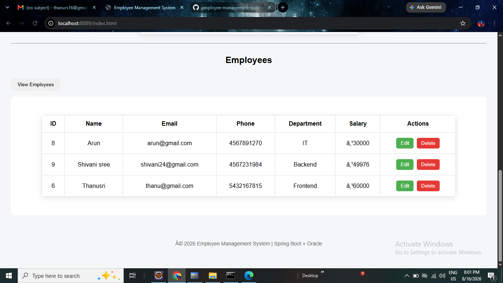

# Employee Management System

A simple Employee Management System built using Java, Spring Boot, Spring Data JPA, Oracle Database, HTML, CSS, and JavaScript.

## Features

* Add employee
* View all employees
* View employee by ID
* Update employee details
* Delete employee
* Store employee data in Oracle Database
* REST APIs tested using Postman
* Simple web interface for employee management

## Technologies Used

* Java 21
* Spring Boot
* Spring Data JPA
* Oracle Database XE
* Maven
* HTML
* CSS
* JavaScript
* Postman
* Eclipse IDE

## Project Structure

```text
employee-management-system
├── src
│ ├── main
│ │ ├── java
│ │ │ └── com.employee.management
│ │ │ ├── controller
│ │ │ ├── repository
│ │ │ ├── service
│ │ │ ├── Employee.java
│ │ │ └── EmployeeManagementSystemApplication.java
│ │ └── resources
│ │ ├── static
│ │ │ ├── index.html
│ │ │ ├── script.js
│ │ │ └── style.css
│ │ └── application.properties
│ └── test
├── pom.xml
├── mvnw
└── mvnw.cmd
```

## API Endpoints

| Method | Endpoint | Description |
| ------ | ----------------- | ------------------ |
| POST | `/employees` | Add employee |
| GET | `/employees` | Get all employees |
| GET | `/employees/{id}` | Get employee by ID |
| PUT | `/employees/{id}` | Update employee |
| DELETE | `/employees/{id}` | Delete employee |

## Database

The application uses Oracle XE as the database and Spring Data JPA/Hibernate for database operations.

## Author

Thanusri.R.S
## Project Screenshot



